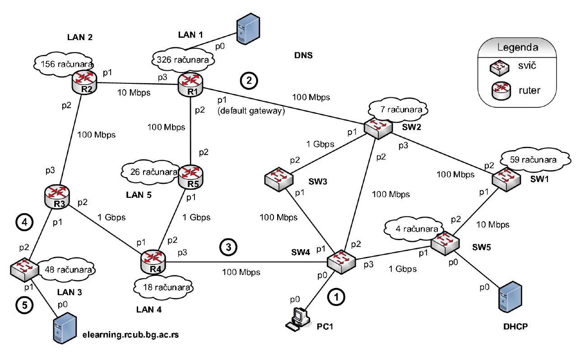

**Zadatak**: Date su adrese koje počinju od `10.50.45.64`. Odrediti IP adrese i maske svih podmreža uz uslov da se adrese dodeljuju u rastućem poretku, računato od prve moguće slobodne adrese, a nakon toga bez „preskakanja“ i vraćanja na eventualno neiskorišćene opsege, najpre većim, a zatim manjim podmrežama (prema broju uređaja), dok za point-po-point veze treba koristiti sledeći redosled: R1-R2, R1-R5, R2-R3, R3-R4, R4-R5. Manju IP adresu interfejsa rutera dodeliti na strani rutera sa manjim indeksom (brojem rutera).



Podmrežu koja se sastoji od svičeva SW1, SW2, SW3, SW4, SW5, računara PC1 i servera DHCP posmatrati kao mrežu LAN6.

**Rešenje**:
```
Sortirajmo mreže po veličini:

LAN1 - 327 uređaja (326 računara i 1 server (DNS) )
LAN2 - 156 uređaja
LAN6 - 72 uređaja (59 (SW1) + 7 (SW2) + 4 (SW5) + 1 (PC1) = 71 računar i 1 server (DHCP))
LAN3 - 49 uređaja (48 računara i 1 server (elearning))
LAN5 - 26 uređaja
LAN4 - 18 uređaja

IP adrese raspoređujemo u ovom redolsedu.
-----------------------------------------

LAN1 - broj potrebnih adresa: 327 + 1 (ruter) + 2 (adresa mreže i broadcast) = 330 <= 512
     - potrebna nam je mreža sa maskom /23 
     - prva slobodna adresa je 10.50.45.64 tj.
     - 0000 1010.0011 0010.0010 110|1.0100 0000
     - primetimo da ova adresa ne može predstavljati adresu mreže sa maskom /23
     - potrebno je odrediti prvu sledeću adresu koja može predstavljati adresu takve mreže
     - potrebno je da desni deo mreže bude 0.0000 0000 pa je prva takva adresa
     - 0000 1010.0011 0010.0010 111|0 0000 0000/23 tj. 10.50.46.0/23
     - adresa mreže:     10.50.46.0/23
     - broadcast adresa: 10.50.47.255/23

LAN2 - broj potrebnih adresa: 156 + 1 (ruter) + 2 (adresa mreže i broadcast) = 159 <= 256
     - potrebna nam je mreža sa maskom /24 
     - prva slobodna adresa je 10.50.48.0 tj.
     - 0000 1010.0011 0010.0011 0000.|0000 0000
     - adresa mreže:     10.50.48.0/24
     - broadcast adresa: 10.50.48.255/24
     
LAN6 - broj potrebnih adresa: 72 + 2 (ruteri) + 2 (adresa mreže i broadcast) = 76 <= 128
     - potrebna nam je mreža sa maskom /25 
     - prva slobodna adresa je 10.50.49.0 tj.
     - 0000 1010.0011 0010.0011 0001.0|000 0000
     - adresa mreže:     10.50.49.0/25
     - broadcast adresa: 10.50.49.127/25
     
LAN3 - broj potrebnih adresa: 49 + 1 (ruter) + 2 (adresa mreže i broadcast) = 52 <= 64
     - potrebna nam je mreža sa maskom /26
     - prva slobodna adresa je 10.50.49.128 tj.
     - 0000 1010.0011 0010.0011 0001.10|00 0000
     - adresa mreže:     10.50.49.128/26
     - broadcast adresa: 10.50.49.191/26

LAN5 - broj potrebnih adresa: 26 + 1 (ruter) + 2 (adresa mreže i broadcast) = 29 <= 32
     - potrebna nam je mreža sa maskom /27
     - prva slobodna adresa je 10.50.49.192 tj.
     - 0000 1010.0011 0010.0011 0001.110|0 0000
     - adresa mreže:     10.50.49.192/27
     - broadcast adresa: 10.50.49.223/27

LAN4 - broj potrebnih adresa: 18 + 1 (ruter) + 2 (adresa mreže i broadcast) = 21 <= 32
     - potrebna nam je mreža sa maskom /27
     - prva slobodna adresa je 10.50.49.224 tj.
     - 0000 1010.0011 0010.0011 0001.111|0 0000
     - adresa mreže:     10.50.49.224/27
     - broadcast adresa: 10.50.49.255/27
     
point-to-point segmenti:

R1-R2 - adresa mreže     : 10.50.50.0/30
      - adresa rutera R1 : 10.50.50.1/30
      - adresa rutera R2 : 10.50.50.2/30
      - broadcast adresa : 10.50.50.3/30
      
R1-R5 - adresa mreže     : 10.50.50.4/30
      - adresa rutera R1 : 10.50.50.5/30
      - adresa rutera R5 : 10.50.50.6/30
      - broadcast adresa : 10.50.50.7/30
      
R2-R3 - adresa mreže     : 10.50.50.8/30
      - adresa rutera R2 : 10.50.50.9/30
      - adresa rutera R3 : 10.50.50.10/30
      - broadcast adresa : 10.50.50.11/30
      
R3-R4 - adresa mreže     : 10.50.50.12/30
      - adresa rutera R3 : 10.50.50.13/30
      - adresa rutera R4 : 10.50.50.14/30
      - broadcast adresa : 10.50.50.15/30
      
R4-R5 - adresa mreže     : 10.50.50.16/30
      - adresa rutera R4 : 10.50.50.17/30
      - adresa rutera R5 : 10.50.50.18/30
      - broadcast adresa : 10.50.50.19/30
      
Najmanja mreža koja agregira sve podmreže:

Najmanja adresa koju smo dodelili: 0000 1010.0011 0010.0010 1110.0000 0000
Najveca adresa koju smo dodelili : 0000 1010.0011 0010.0011 0010.0001 0011

Najduži zajednički prefiks ovih adresa је 0000 1010.0011 0010.001 tj. 
maska je /19 pa je adresa najmanje mreže 10.50.32.0/19
```
